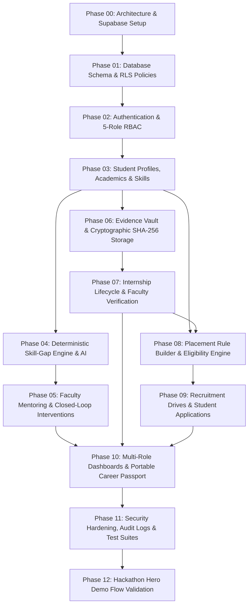

# PRAGATI — Phase-Wise Specifications Index

This directory contains the modular, phase-wise specification documents for implementing **PRAGATI: Smart Student Internship & Career Management Platform** using **Supabase** (PostgreSQL, Supabase Auth, Row Level Security, Supabase Storage, and Realtime).

Each specification file serves as an independent, authoritative contract for an AI coding agent or human engineer executing that phase.

---

## 🗺️ Phase Roadmap & Dependency Graph

---

## 📋 Directory Manifest

| Spec File | Phase Title | Primary Focus & Deliverables |
| :--- | :--- | :--- |
| [phase-00-architecture-supabase.spec.md](file:///d:/Project/Pragati/specs/phase-00-architecture-supabase.spec.md) | **Phase 00: Foundation & Supabase Setup** | Environment configuration, Supabase client initialization, Drizzle ORM setup with Postgres. |
| [phase-01-database-schema-rls.spec.md](file:///d:/Project/Pragati/specs/phase-01-database-schema-rls.spec.md) | **Phase 01: Database Schema & RLS** | DDL migrations for 26 tables, foreign keys, RLS security policies, seed fixtures for institutional master data. |
| [phase-02-auth-rbac.spec.md](file:///d:/Project/Pragati/specs/phase-02-auth-rbac.spec.md) | **Phase 02: Auth & 5-Role RBAC** | Supabase Auth integration, session management, 5-role RBAC middleware, IDOR protection guards. |
| [phase-03-student-academics-skills.spec.md](file:///d:/Project/Pragati/specs/phase-03-student-academics-skills.spec.md) | **Phase 03: Student Profile, Academics & Skills** | Student profiles, semester GPA/CGPA tracking, backlogs, skill taxonomy, assessment submission & score histories. |
| [phase-04-skill-gap-rules-ai.spec.md](file:///d:/Project/Pragati/specs/phase-04-skill-gap-rules-ai.spec.md) | **Phase 04: Skill-Gap Rule Engine & Assistive AI** | Deterministic gap detection (e.g. DSA decline + backlog), AI explanation generator, versioned prompts, fallback logic. |
| [phase-05-faculty-mentoring-interventions.spec.md](file:///d:/Project/Pragati/specs/phase-05-faculty-mentoring-interventions.spec.md) | **Phase 05: Faculty Mentoring & Interventions** | Faculty ward roster, skill-gap alerts, mentoring session creation, re-assessment triggers, gap resolution cycle. |
| [phase-06-evidence-sha256-storage.spec.md](file:///d:/Project/Pragati/specs/phase-06-evidence-sha256-storage.spec.md) | **Phase 06: Evidence Documents & SHA-256 Storage** | Supabase Storage (`evidence-vault`), SHA-256 client/server hashing, MIME/size validation, tamper detection demo. |
| [phase-07-internship-verification.spec.md](file:///d:/Project/Pragati/specs/phase-07-internship-verification.spec.md) | **Phase 07: Internship Lifecycle & Verification** | Internship milestones (Offer, Check-ins, Report, Certificate), 5 verification states, faculty verification workflow. |
| [phase-08-placement-rules-eligibility.spec.md](file:///d:/Project/Pragati/specs/phase-08-placement-rules-eligibility.spec.md) | **Phase 08: Placement Rules & Deterministic Engine** | T&P rule builder UI, JSON expression tree evaluator, transparent eligibility explanations (*"Why eligible / ineligible"*). |
| [phase-09-recruitment-applications.spec.md](file:///d:/Project/Pragati/specs/phase-09-recruitment-applications.spec.md) | **Phase 09: Recruitment Drives & Applications** | Drive publishing, student application workflow, idempotent submission, candidate pipeline management. |
| [phase-10-dashboards-career-passport.spec.md](file:///d:/Project/Pragati/specs/phase-10-dashboards-career-passport.spec.md) | **Phase 10: Role Dashboards & Career Passport** | Student, Faculty, HOD, T&P, Admin dashboards; Portable Career Passport with verified badges and export. |
| [phase-11-security-audit-testing.spec.md](file:///d:/Project/Pragati/specs/phase-11-security-audit-testing.spec.md) | **Phase 11: Security, Audit Logging & Test Suites** | Immutable audit logs, rate limiting, Vitest tests (RBAC, IDOR, tamper, eligibility engine). |
| [phase-12-demo-flow-validation.spec.md](file:///d:/Project/Pragati/specs/phase-12-demo-flow-validation.spec.md) | **Phase 12: Hackathon Hero Demo Flow** | Step-by-step 12-scene verification script (Rahul Sharma Year 3 CS journey) from skill gap to drive offer. |

---

## 🛠️ Execution Protocol for AI Coding Agents

1. **Sequential Order**: Always implement phases in sequential order (Phase 00 through Phase 12).
2. **Phase Isolation**: Never make out-of-scope edits in earlier or later phases.
3. **Checklist Verification**: Before marking a phase complete in `brain/17_PROGRESS.md`, run the automated tests specified in the phase spec.
4. **Non-Negotiable Rule**: Follow the 25 engineering mandates in `brain/STRICT.MD` at all times.
